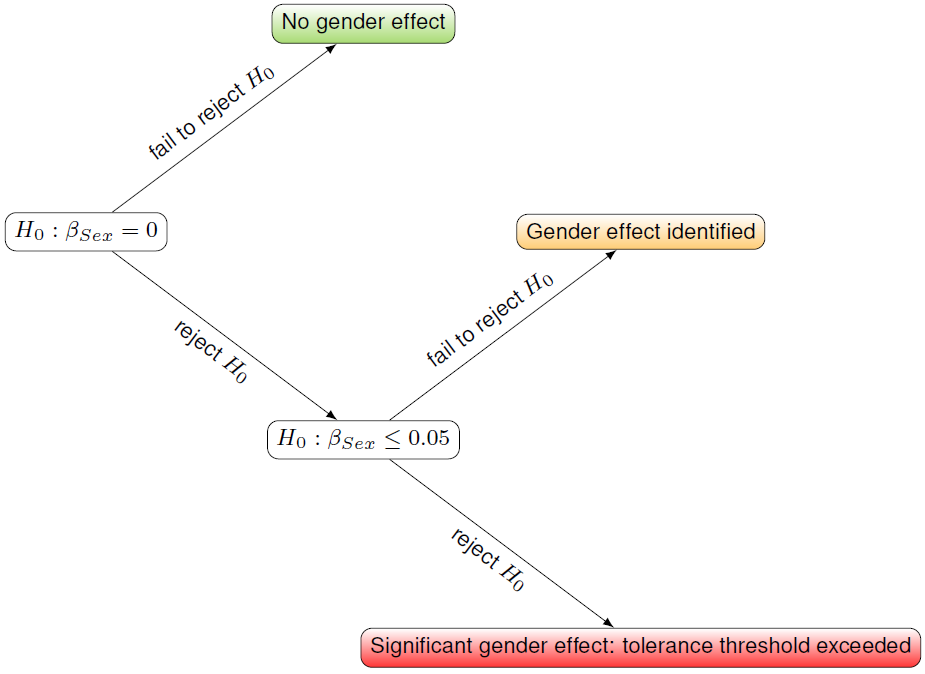

# Introduction

Tendering companies are bound by the Swiss law on public procurement to comply with the principle of wage equality between women and men, thus conforming to Swiss legislation and international agreements. The aim is also to prevent distortions of competition which disadvantage employers who implement a fair wage policy. The Federal Office for Gender Equality (FOGE) is mandated by the Fed-eral Procurement Conference (FPC) to carry out controls.

The present document describes the current situation regarding the methodological approach and serves as a guide for conducting the standardised analysis for monitoring compliance with wage equality.

# Methodology

The Swiss Confederation's standard analysis for equal pay analysis is based on the approach of the *linear regression*, a statistical method which provides a formal explanation of a dependent variable in relation to one or more independent variables. Alternatively, the dependent variable is also called the explained variable and the independent variables are called the explanatory variables.

## Data basis

The standard analysis model is evaluated at company-level and thus, the following data is required for each employee of the company:

+ *sex*, the biological sex of the employee, female or male
+ *age*, the age of the employee
+ *training*, the training of the employee, a code from 1 to 8 which is then used to compute the years spent in education for each employee
  1. University : 17 years
  2. University of applied sciences (HES) : 15 years
  3. Higher vocational training and education : 14 years
  4. Teaching certificate : 15 years
  5. Matura : 13 years
  6. Vocational training and education : 12 years
  7. In-house vocational training : 11 years
  8. Compulsory schooling : 7 years
+ *years of service*, the number of years spent by the employee in the current company
+ *required level of professional skills*, the skill level required by the job performed by the employee, a code from 1 to 4 defined as:
  1. Complex problem solving and decision making
  2. Relatively complex technical or practical skills
  3. Tasks requiring special professional knowledge
  4. Simple and repetitive tasks
+ *professional position*, the professional position of the job performed by the employee, a code from 1 to 5 defined as:
  1. Senior and higher management
  2. Middle management
  3. Lower management
  4. Lowest management
  5. No management function
+ *individual working hours*, the number of hours worked in the month of reference or the contractual activity rate of the employee
+ *gross wage*, the basic wage, $13^\text{th}$ salary, allowances, and bonuses and premiums earned by the employee in the month of reference
+ *function*, the name of the job/function performed by the employee

## Linear regression

The general form of the regression equation with *n* observations and *p* independent variables is given by:

$$ Y_i = \beta_0 + \beta_1 X_1 + \beta_2 X_2 + \beta_3 X_3 + {}\dots{} + \beta_p X_p + \epsilon_i, $$
for $i = 1, 2, {}\dots{}, n$.

|                   |                                                                                                                   |
|-------------------|-------------------------------------------------------------------------------------------------------------------|
|$Y_i$              |dependent variable for the $i^\text{th}$ individual (e.g. the wage of employee $i$)                                |
|$X_i - X_p$        |independent variables for the $i^\text{th}$ individiual (e.g. age, seniority, job complexity, etc. of employee $i$)|
|$\beta_0$          |point of intersection of the regression line with the ordinate axis (intercept), i.e. the constant                 |
|$\beta_1 - \beta_p$|coefficients characterising the regression line. The value of a coefficient $\beta_j$ indicates the marginal effect of an increase in one unit of the variable $X_j$ on the dependent variable|
|$\epsilon_i$       |error term for the $i^\text{th}$ individual. The error term indicates the discrepancy between a real value and what the model would estimate (e.g. the difference between the actual wage and the estimated wage of employee $i$)|

The regression coefficients $\beta_0, \dots, \beta_p$ are estimated by minimizing the sum of squared residuals $\sum_{i=1}^n \epsilon_i^2$, this is called the ordinary least squares (OLS) approach.

## Specification of the standard analysis model

With a slight abuse of notation, the particular formula used in the Confederation's standard analysis model reads as:

$$ \ln(Wage_i) = \beta_0 + \beta_{Educ} \cdot Educ_i + \beta_{Exp} \cdot Exp_i + \beta_{Exp^2} \cdot Exp_i^2 + \beta_{Tnr} \cdot Tnr_i + \beta_{Skl} \cdot Skl_i + \beta_{Pos} \cdot Pos_i + \beta_{Sex} \cdot Sex_i + \epsilon_i$$
where,

|                   |                                                                                                                   |
|-------------------|-------------------------------------------------------------------------------------------------------------------|
|$\ln(Wage_i)$      |logarithm of the gross wage standardised to a full-time job of employee $i$.                                       |
|$Educ_i$           |years of education of employee $i$, converted from the training code as explained above.                           |
|$Exp_i$            |years of potential experience of employee $i$. This variable also enters the equation in its squared form as the effect of professional experience on wages is generally non-linear according to economic theory.                                                               |
|$Tnr_i$            |years of service in the current company for employee $i$.                                                          |
|$Skl_i$            |required level of professional skills for the job performed by the employee $i$. This variable enters the regression equation as a categorical variable^[A categorical variable implies that we use so-called *dummy variables* to represent it in the equation, i.e. $\beta_{Skill} \cdot Skl_i$ becomes $\beta_{Skl_1} \cdot \mathbb{1}\{Skl_i = 1\} + \beta_{Skl_2} \cdot \mathbb{1}\{Skl_i = 2\} + \beta_{Skl_3} \cdot \mathbb{1}\{Skl_i = 3\}$, with $\mathbb{1}\{\text{predicate}\}$ being the indicator function, which returns 1 when the predicate is true and 0 otherwise (note that the fourth level is absorbed in the intercept).] with four levels (see above for a description of the levels). |
|$Pos_i$            |professional position for the job performed by the employee $i$. This variable enters the regression equation as a categorical variable with five levels (see above for a description of the levels). |
|$Sex_i$            |biological sex of the employee $i$, 1 for women and 0 for men.                                                     |

A particularity of this model is the logarithmic form of the dependent variable, i.e. $\ln(Wage_i)$. When the logarithm of the dependent variable is used, the regression equation is said to be *semi-logarithmic* or *log-level*. In a semi-logarithmic regression, the interpretation of the coefficients $\beta_1, {}\dots{}, \beta_p$ changes slightly: under this form, $\beta_j$ can be interpreted as a percentage^[To be fully correct, it is an approximation of a percentage.] increase of the wage when the variable $X_j$ is increased by one unit. For instance, if $\beta_{Educ} = 0.02$, the model indicates that an additional year of education will increase the gross standardised wage by approximately $(100 \cdot \beta_{Educ})\% = 2\%$.

### Estimation of the discrimination coefficient  

The coefficient $\beta_{Sex}$ then represents the marginal effect of being a woman on the wage, this is called the "discrimination coefficient" and it represents the wage difference due to the sex of the employee with all other factors being equal, i.e. the wage difference which cannot be attributed to the objective factors taken into account.y

To estimate the impact of the sex on the wage, we use the estimator due to [Kennedy (1981)](https://www.jstor.org/stable/23114086), which yields a nearly unbiased estimator and is formulated as:

$$ \tau_K = \exp{\left(\beta_{Sex} - \frac{\mathbb{V}[\beta_{Sex}]}{2}\right)} - 1, $$
with $\exp(\cdot)$ being the natural exponential function and $\mathbb{V}[\beta_{Sex}]$ being the variance of the estimated sex coefficient.

For instance, if $\beta_{Sex} = -0.061$ and $\mathbb{V}[\beta_{Sex}] = 0.041$, then $\tau_K = \exp{\left(- 0.061 - \frac{0.041}{2}\right)} - 1 = -0.0783$, which implies that, under otherwise equal circumstances, women earn 7.83% less than men.

### Significance of the discrimination coefficient

Estimating a parameter such as the discrimination coefficient always entails an element of uncertainty. Therefore, the value of the discrimination coefficient does not tell the whole story and its so-called *statistical significance* must also be taken into account. Given a so-called *null hypothesis* ($H_0$), a result is said to be statistically significant if it is very unlikely to have occured by chance under the null hypothesis.

The probability of the null hypothesis being true given the observed data is assessed by a Student's *t*-test, where the results obtained from the regression analysis are compared with a critical value from the Student's *t* distribution. If the probability of the null hypothesis being true is lower than a given confidence level $\alpha$^[in this case, for the Confederation's standard analysis model, the confidence level is set to be $\alpha = 95\%$], it is rejected in favor of the alternative hypothesis and we say that the sex effect is statistically significant.

The Swiss Confederation's standard analysis model assesses the significance of the discrimination coefficient in two steps:

1. The null hypothesis of no discrimination is tested.
2. The null hypothesis of a discrimination of 5% or less is tested.

In the first step, the null and alternative hypotheses can be formulated as follows:

+ $H_0: \beta_{Sex} = 0$, the sex effect is equal to zero 
+ $H_A: \beta_{Sex} \neq 0$, the sex effect is not equal to zero

In other words, this null hypothesis is that women and men earn the same amount under otherwise equal circumstances, i.e. that there is **no discrimination**. The alternative hypothesis, on the other hand, is the logical negation of the null hypothesis and it implies that there exists **discrimination**.

If the null hypothesis of no discrimination is rejected in favor of its alternative hypothesis, the second step then assesses whether the discrimination exceeds the specified threshold of 5%. This gives the following hypotheses:

+ $H_0: \beta_{Sex} \leq 0.05$, the sex effect is smaller or equal to 5%
+ $H_A: \beta_{Sex} > 0.05$, the sex effect is greater than 5%

In the second step, if the null hypothesis is rejected in favor of its alternative, the discrimination exceeds the tolerance threshold and thus **the principle of equal pay is not respected**.

